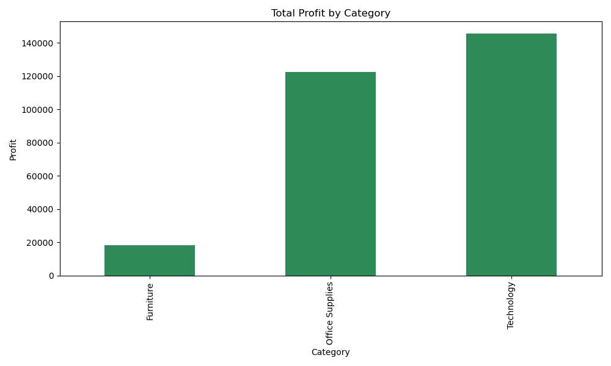
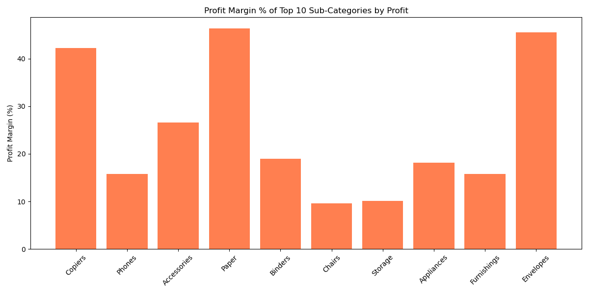
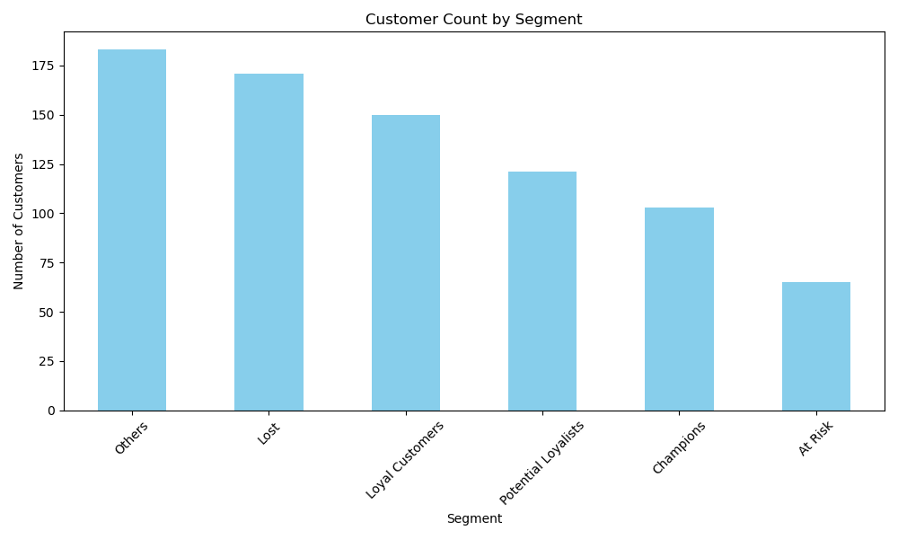
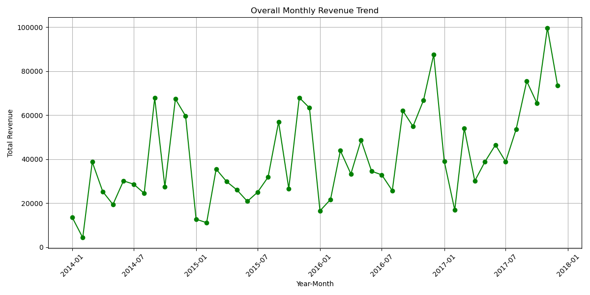
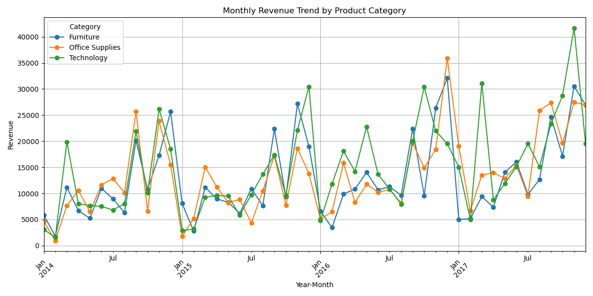

# Superstore Sales Analysis

This project aims to analyze the sales performance of a Superstore dataset, providing insights into customer behavior, profitability, and sales trends. The project covers various data analysis tasks including data cleaning, customer segmentation, profitability analysis, and trend visualization.

## 📁 Project Structure

```
Superstore_Sales_Analysis/
├── data/
│   ├── Superstore_Sales_Full.csv            # Raw data file
│   ├── Cleaned_Superstore_Sales.csv         # Cleaned data after preprocessing
│   ├── rfm_scores.csv                       # RFM analysis results
│   ├── rfm_segment_summary.csv              # Summary of RFM segments
│   ├── profitability_summary.csv            # Profitability analysis results
│   └── overall_sales_trends.csv             # Monthly sales trends
├── scripts/
│   ├── data_cleaning.py                     # Data cleaning and preprocessing
│   ├── profitability_analysis.py            # Profitability analysis script
│   ├── rfm_analysis.py                      # RFM analysis for customer segmentation
│   └── sales_trend_analysis.py              # Sales trend analysis
├── plots/                                   # Directory for saving plots
│   ├── total_profit_by_category.png
│   ├── profit_margin_top_subcategories.png
│   ├── rfm_customer_segments.png
│   ├── overall_sales_trend.png
│   └── category_sales_trend.png
└── 
```

## 📝 Project Phases

1. **Data Cleaning (Python)**

   * Removed duplicates and missing values.
   * Calculated revenue and profit margin.

2. **Profitability Analysis (Python)**

   * Calculated profit margins and identified top-performing sub-categories.

3. **RFM Analysis (Python)**

   * Segmented customers based on Recency, Frequency, and Monetary values.

4. **Sales Trend Analysis (Python)**

   * Analyzed overall sales trends and category-wise revenue over time.

## 📊 Sample Outputs

* **Total Profit by Category**
  

* **Profit Margin (Top 10 Sub-Categories)**
  

* **RFM Customer Segments**
  

* **Overall Monthly Sales Trend**
  

* **Category-wise Sales Trend**
  

## 🚀 Getting Started

1. Clone the repository:

   ```bash
   git clone https://github.com/DevtronixAI42/Superstore-Sales-Analysis.git
   cd Superstore-Sales-Analysis
   ```

2. Install the required packages:

   ```bash
   pip install -r requirements.txt
   ```

3. Run the scripts:

   ```bash
   python scripts/data_cleaning.py
   python scripts/profitability_analysis.py
   python scripts/rfm_analysis.py
   python scripts/sales_trend_analysis.py
   ```

## 📄 License

This project is licensed under the MIT License - see the LICENSE file for details.

## 🤝 Contributing

Contributions are welcome! Please fork the repository and create a pull request with your improvements.
